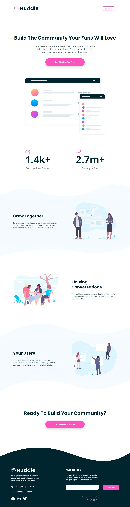
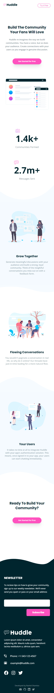

# Front End Mentor - Project 032 - Huddle Landing Page with Curved Sections

This is a solution to the [Huddle Landing Page with Curved Sections challenge on Frontend Mentor](https://www.frontendmentor.io/challenges/huddle-landing-page-with-curved-sections-5ca5ecd01e82137ec91a50f2).

## Table of contents

- [Overview](#overview)
  - [Screenshot + Video](#screenshot--video)
  - [Links](#links)
- [My process](#my-process)
  - [Built with](#built-with)
  - [What I learned](#what-i-learned)
  - [Useful resources](#useful-resources)
- [Author](#author)

## Overview

### Screenshot + Video

- Desktop

https://user-images.githubusercontent.com/121501991/232126066-84d5f1fa-63d6-4a6e-adcd-904c95c90c8a.mp4

 

- Mobile

https://user-images.githubusercontent.com/121501991/232126159-ce16eb26-58aa-483f-afe0-c6c2ba448841.mp4

 

### Links

- Solution URL: https://github.com/rashidshamloo/fem_032_huddle-landing-page-with-curved-sections/
- Live Site URL: https://rashidshamloo.github.io/fem_032_huddle-landing-page-with-curved-sections/

## My process

### Built with

- Vite / React.js
- TypeScript
- Tailwind CSS
- Framer Motion

### What I learned

- Setting the color of an image to white using `filter: brightness(0) invert(1);` in CSS
- Using `react-email-validator` package for email validation in React.js
- Using `setInterval()` function and `useEffect()` and `useInView()` hooks to implement a count up when in view component.
- Using `useAnimation()` hook in Framer Motion and triggering different animations using it
- Using `useMediaQuery()` hook from `react-responsive` package to apply different settings for different screen sizes
- Different ways of applying animations to elements when in view using `Framer Motion`

### Useful resources

- [Framer Motion](https://www.framer.com/motion/) - The animation library i used in this challenge
- [react-email-validator](https://www.npmjs.com/package/react-email-validator) - The email validator package i used in this challenge
- [react-responsive](https://www.npmjs.com/package/react-responsive) - The package i used for detecting screen sizes (`useMediaQuery()` hook)

## Author

- Portfolio - [rashidshamloo.ir](https://www.rashidshamloo.ir)
- Linkedin - [rashid-shamloo](https://www.linkedin.com/in/rashid-shamloo/)
- Frontend Mentor - [@rashidshamloo](https://www.frontendmentor.io/profile/rashidshamloo)
- Twitter - [@rashidshamloo](https://www.twitter.com/rashidshamloo)
